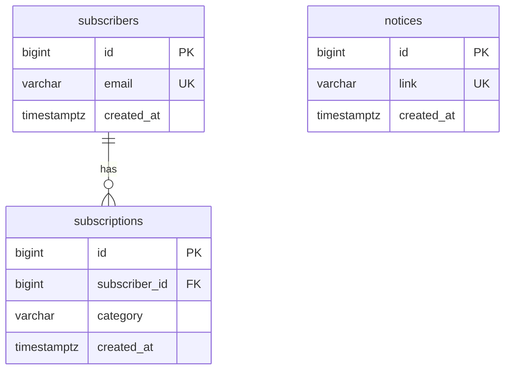

# ERD

```mermaid
erDiagram
    subscribers ||--o{ subscriptions : "has"
    
    notices {
        bigint id PK
        varchar link UK
        timestamptz created_at
    }

    subscribers {
        bigint id PK
        varchar email UK
        timestamptz created_at
    }

    subscriptions {
        bigint id PK
        bigint subscriber_id FK
        varchar category
        timestamptz created_at
    }
```
