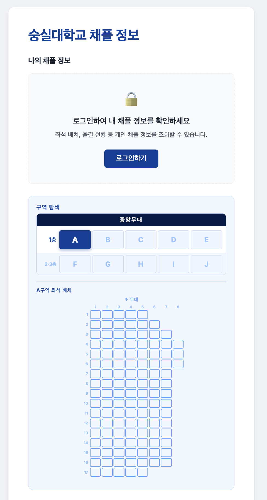
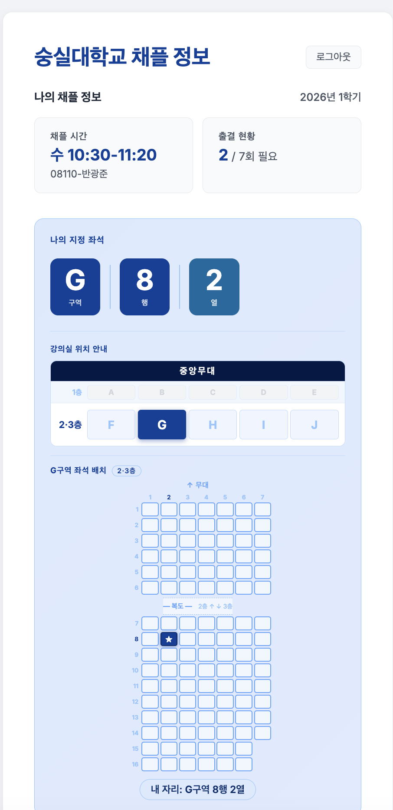

# SSU Chapel 서비스 소개

> 숭실대학교 채플 정보를 더 쉽고 빠르게 — 학생을 위한 채플 도우미 서비스

---

## 왜 이 서비스를 만들었나요?

숭실대학교 학생이라면 한 번쯤 이런 경험을 해봤을 겁니다.

> "내 채플 좌석이 어딘지 까먹었는데, 유세인트 들어가서 어디서 확인하더라?"
> "이번 학기 채플 몇 번이나 결석했지? 아슬아슬한 것 같은데…"
> "개강 첫 주에 채플 가야 하는데, 자리를 못 찾겠어."

채플 정보는 유세인트(U-Saint)에 분명히 있습니다. 하지만 유세인트는 전체 학사 시스템을 아우르는 복잡한 플랫폼이라, 채플 정보 하나를 확인하려 해도 여러 단계를 거쳐야 합니다. 모바일에서는 더욱 불편하죠.

**SSU Chapel**은 이 불편함을 해결하기 위해 만들어진 서비스입니다. 유세인트 로그인 정보를 그대로 사용하면서, 채플에 관한 정보만 깔끔하게 보여주는 것이 목표입니다.

---

## 서비스 한눈에 보기

| 비로그인 상태 | 로그인 후 |
|:---:|:---:|
|  |  |
| 좌석 구역 탐색은 로그인 없이도 가능 | 내 좌석·출결 현황이 한눈에 표시 |

SSU Chapel은 크게 세 가지 기능으로 구성되어 있습니다.

### 1. 내 채플 좌석 확인 + 시각적 좌석 지도

채플에 처음 가거나, 오랜만에 가서 내 자리가 헷갈릴 때를 위한 기능입니다.

로그인하면 내 좌석이 **구역 - 열 - 번호** 형식으로 바로 표시됩니다. 예를 들어 `C구역 5열 3번`처럼요. 여기서 그치지 않고, **실제 채플 건물 좌석 배치도**를 인터랙티브하게 제공합니다.

- 한경직기념관 1층과 2·3층을 구분하여 보여줍니다.
- A~J 구역 중 내 구역을 클릭하면, 해당 구역의 세부 좌석 배치가 펼쳐집니다.
- 내 자리는 ★ 표시로 강조됩니다.
- 로그인 없이도 채플 건물 구조를 미리 둘러볼 수 있습니다.

**기획 의도**: 텍스트만으로는 자리를 찾기 어렵습니다. 특히 처음 채플에 가는 1학년 학생이나, 전공관 건물도 아직 낯선 시기에 채플 좌석을 빠르게 파악할 수 있도록 시각적인 안내를 제공하고자 했습니다.

---

### 2. 출결 현황 대시보드

이번 학기에 채플을 몇 번 출석했는지, 몇 번 결석했는지, 지금 상황이 괜찮은지 한눈에 보여줍니다.

- 출석 횟수 / 필요 횟수를 나란히 표시
- 현재 상태: **이수 예정 / 위험 / 미이수** 중 하나로 색상과 함께 강조
- 결석 횟수가 기준치에 근접하면 경고 표시
- 회차별 상세 출결 목록 (날짜, 강사, 채플 유형, 출결 상태 포함)

**기획 의도**: 학생이 직접 수를 세거나 계산하지 않아도, 지금 내 채플 이수 상황이 안전한지 위험한지를 즉시 알 수 있게 하고 싶었습니다. 특히 학기 말에 "혹시 채플 이수 못 하는 거 아닐까?" 하는 불안을 줄여주기 위한 기능입니다.

---

### 3. UTM + QR 코드 생성 도구 (별도 페이지)

이 기능은 채플 운영팀이나 홍보 담당자를 위한 도구입니다.

UTM이란 링크에 붙이는 **출처 태그**입니다. 예를 들어, 같은 채플 안내 링크를 카카오톡으로 보낼 때와 인스타그램에 게시할 때 각각 어디서 더 많이 클릭했는지 파악할 수 있게 해줍니다.

- 링크 출처(source), 캠페인명, 콘텐츠 구분을 간단히 입력
- 카카오, 인스타그램, 에브리타임 등 자주 쓰는 채널은 버튼 하나로 빠르게 입력
- 생성된 링크의 **QR 코드를 즉시 생성** → 인쇄물, 포스터에 바로 활용 가능
- 생성한 UTM 링크를 저장하고 목록으로 관리 가능
- QR 코드 이미지 PNG 다운로드 지원

**기획 의도**: 채플 홍보나 출석 독려를 위해 다양한 채널에 링크를 뿌릴 때, 어느 채널이 효과적인지 데이터로 확인하고 싶은 니즈가 있습니다. 개발 지식 없이도 직접 UTM 링크와 QR 코드를 만들 수 있도록 UI를 단순하게 설계했습니다.

---

## 개인정보는 어떻게 보호되나요?

서비스 특성상 유세인트 로그인 정보를 다루기 때문에, 개인정보 처리에 각별히 신경 썼습니다.

- 아이디/비밀번호는 유세인트 인증을 위해 일시적으로만 사용되며, 서버에 저장되지 않습니다.
- 인증 후 발급되는 **토큰**만 기기에 임시 저장되고, 로그아웃 시 즉시 삭제됩니다.
- 채플 데이터는 짧은 시간 동안 캐시(임시 저장)되어 서비스 속도를 높이지만, 만료 시간이 지나면 자동으로 파기됩니다.
- 수집한 정보는 채플 조회 이외의 목적으로 사용되지 않으며, 제3자에게 제공되지 않습니다.

---

## 서비스 디자인 원칙

SSU Chapel은 다음 세 가지 원칙 아래 화면을 설계했습니다.

### 원칙 1. 숭실대 맥락에 맞는 시각적 언어

배경색, 주 색상, 버튼 스타일 모두 숭실대 LMS(학습관리시스템)의 디자인과 통일감을 주도록 맞췄습니다. 학생들이 이미 익숙한 환경과 유사하게 만들어 낯선 느낌을 줄이는 것이 목적입니다.

### 원칙 2. 모바일 우선

대부분의 학생은 스마트폰으로 채플 정보를 확인합니다. 작은 화면에서도 정보가 잘 보이고 버튼을 누르기 쉽도록 레이아웃을 설계했습니다.

### 원칙 3. 로그인 없이도 탐색 가능

처음 방문한 학생이 로그인 전에도 채플 건물 구조를 미리 파악할 수 있도록, 좌석 구역 탐색 기능은 비로그인 상태에서도 사용할 수 있습니다.

---

## 기술 스택 (비전공자를 위한 쉬운 설명)

| 영역 | 사용 기술 | 쉬운 설명 |
|------|-----------|-----------|
| 화면 구성 | React + TypeScript | 사용자가 보는 화면을 만드는 도구 |
| 서버리스 배포 | Cloudflare Pages | 별도 서버 없이 전 세계에 빠르게 배포 |
| 백엔드 | Cloudflare Workers (Rust/WASM) | 유세인트 데이터를 가져오는 처리 담당 |
| 캐시 | Redis | 자주 요청되는 데이터를 빠르게 응답하기 위한 임시 저장소 |
| 분석 | Google Analytics + Microsoft Clarity | 서비스 사용 현황 파악 (익명 데이터) |

---

## 앞으로의 방향

SSU Chapel은 채플 정보 조회를 넘어, 학생들이 채플을 더 잘 이해하고 참여할 수 있는 방향으로 발전해 나가고자 합니다.

현재 서비스는 **조회 중심**이지만, 향후에는 알림 기능, 채플 일정 연동, 출결 예측 등 학생의 채플 생활을 더 능동적으로 지원하는 기능들을 고려할 수 있습니다.

---

*작성일: 2026년 3월 24일*
*서비스 주소: [ssu-chapel.pages.dev](https://ssu-chapel.pages.dev)*
